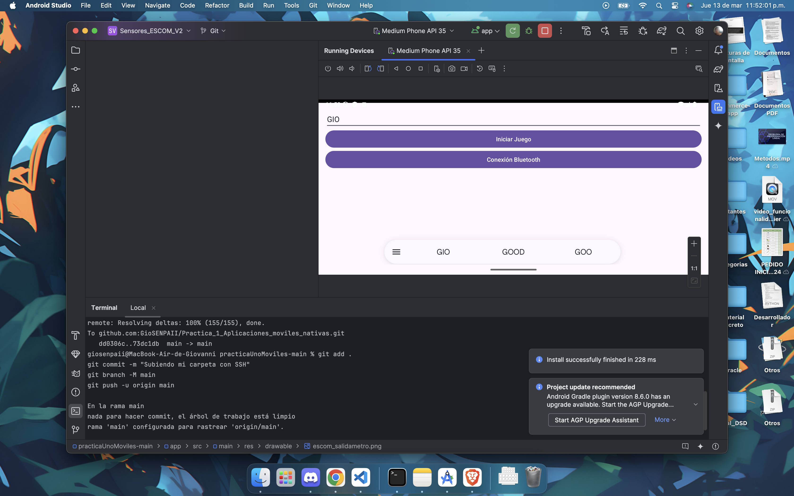
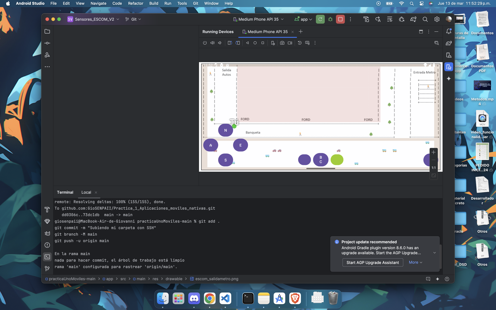
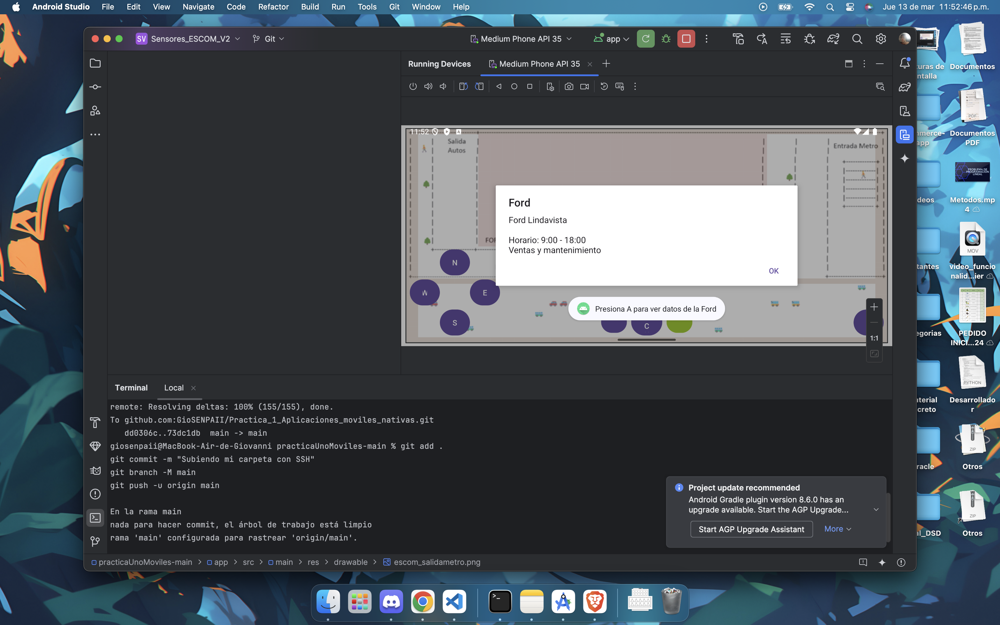
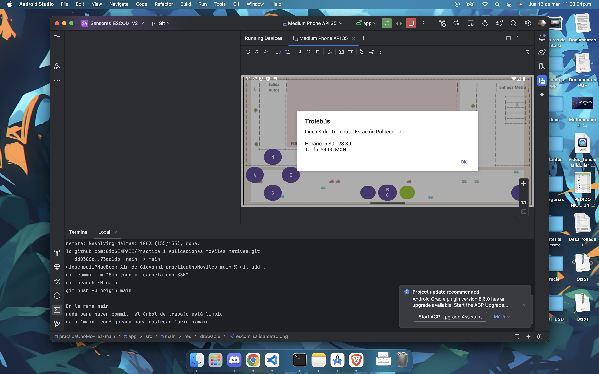
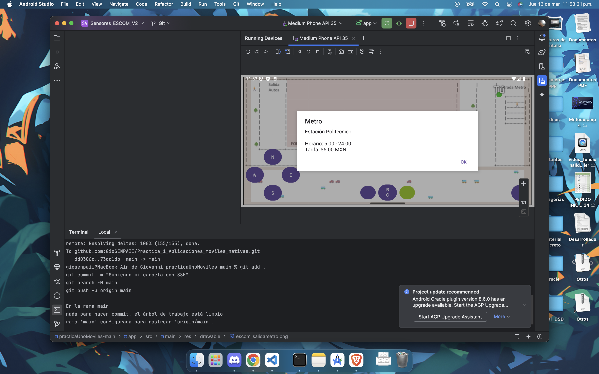

# Sensores ESCOM 

## 1. Descripción detallada del proyecto
Aplicación Android que permite navegar por distintos mapas de la ESCOM (edificio principal, edificio 2, edificio nuevo, salida de Metro, cafetería y salones 2009/2010) utilizando controles táctiles y sensores del dispositivo. Incluye:

- **Multijugador local (Bluetooth)** y **multijugador online (WebSocket)**.  
- **Puntos de interés** con información adicional al pulsar el botón A.  
- **Sistema de colisiones** para evitar atravesar obstáculos.  
- **Persistencia de estado** al cambiar de mapa o actividad.  
- **Elementos dinámicos** (un zombie en la cafetería) que interactúan con los jugadores.

Cada mapa está implementado en una actividad independiente con un sistema compartido de movimiento, colisiones y comunicación con el servidor.

---

## 2. Instrucciones paso a paso para ejecutar y probar la aplicación

### Requisitos
1. **Software**:  
   - Android Studio (Arctic Fox o superior).  
   - Node.js y npm (solo si usas el servidor online).
2. **Hardware**:  
   - Dispositivo Android con Bluetooth y Android 7.0 (API 24) o superior.  

### Configuración y ejecución
1. **Clona el repositorio**:
   ```bash
   git clone https://github.com/tu-usuario/Sensores_ESCOM_V2.git
   cd Sensores_ESCOM_V2
   ```
2. **Configura y lanza el servidor online (opcional)**:
   ```bash
   cd Online-Server
   npm install
   node server.js  # Se ejecuta en el puerto 8080
   ```
3. **Modifica la IP del servidor en OnlineServerManager.kt**:
   ```kotlin
   private const val SERVER_URL = "ws://TU_IP_AQUI:8080"
   ```
4. **Abre el proyecto en Android Studio, conecta tu dispositivo o inicia un emulador y ejecuta la app.**

### Pruebas de la aplicación

**Navegación Básica**
- **Introduce un nombre de usuario** para comenzar.
- Utiliza los **botones direccionales** para explorar el entorno.

**Cambio de Mapas**
- Acércate a las **zonas de transición** (bordes o puertas) para cambiar de edificio o área.

**Interacción con Puntos de Interés**
- Al llegar a **coordenadas destacadas** (ej. (35,5)), aparecerá el mensaje **"Presiona A..."**.
- Pulsa **A** para obtener más información.

**Multijugador Local (Bluetooth)**
1. Un dispositivo actuará como **"Servidor Bluetooth"**.
2. Otro dispositivo actuará como **"Cliente Bluetooth"** para conectarse y ver sus posiciones en tiempo real.

**Multijugador Online**
1. Con un servidor Node.js activo, presiona **"Server"** para conectarte.
2. Conecta múltiples dispositivos y observa la sincronización en tiempo real.

## 3. Capturas de Pantalla  

- **Menu y mapa principal**
  


- **Cambio de mapas**

  
- **Interacción con puntos de interés**  




## 4. Dificultades Encontradas y Soluciones

### Puntos de Interés en la Salida del Metro
**Problema:** No se mostraba la información al pasar sobre las coordenadas relevantes.  
**Solución:** Se implementó un detector de posición que verifica si el jugador está en un punto especial. Si es así, muestra el mensaje **"Presiona A..."** para obtener más información.

```kotlin
   private fun checkPositionForPoints(position: Pair<Int, Int>) {
    if (position == Pair(35, 5)) {
        Toast.makeText(this, "Presiona A para ver datos...", Toast.LENGTH_SHORT).show()
    }
}

private fun handleButtonAPress() {
    if (gameState.playerPosition == Pair(35, 5)) {
        showInfoDialog("Metro", "Información de la estación...")
    }
}
   ```

### Sincronización de Jugadores en Diferentes Mapas
**Problema:** La posición de los jugadores en otros mapas se mezclaba en uno solo.  
**Solución:** Se incluyó el identificador del mapa en los mensajes para filtrar y mostrar solo a los jugadores del mismo mapa.  

### Conexión Persistente en Cambios de Actividad
**Problema:** La app perdía la conexión al servidor al cambiar de mapa.  
**Solución:** Se pasaron datos de conexión a través de `Intents` y se reestableció la conexión automáticamente al iniciar cada nueva actividad.  

### Interfaz para Mostrar Información (Diálogos)
**Problema:** No existía un método para mostrar datos detallados sobre puntos de interés.  
**Solución:** Se implementó el uso de `AlertDialog` para desplegar detalles al pulsar el botón **A**.  

```kotlin
   private fun showInfoDialog(title: String, message: String) {
    AlertDialog.Builder(this)
        .setTitle(title)
        .setMessage(message)
        .setPositiveButton("OK") { dialog, _ -> dialog.dismiss() }
        .show()
}
   ```
### Implementación del Botón A
**Problema:** La interfaz original carecía de un botón dedicado a la interacción.  
**Solución:** Se agregó un `<Button>` al layout y su `listener` llama a `handleButtonAPress()` para gestionar la interacción.  

### Rendimiento en Dispositivos de Gama Baja
**Problema:** Caídas de FPS al renderizar múltiples jugadores y mapas.  
**Solución:** Se optimizó el rendimiento actualizando posiciones y elementos gráficos solo cuando cambian, limitando la frecuencia de renderizado y las llamadas de red.  
